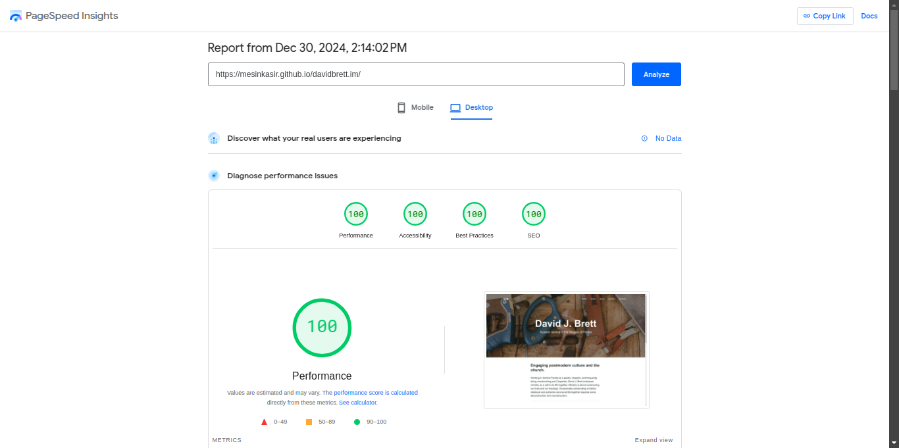
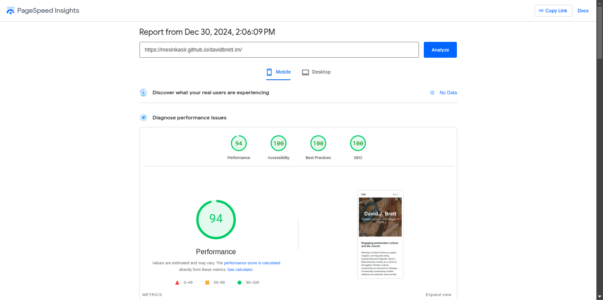

[](https://app.netlify.com/sites/superlative-klepon-a3d521/deploys)
# 11ty Clean Blog Template
[A clean Bootstrap blog theme created by Start Bootstrap](https://github.com/startbootstrap/startbootstrap-clean-blog)

## CHANGELOG

+ Full Migration from jekyll in to 11ty aka eleventy
+ Replace configuration Js / JSON data with YAML/YML
+ Convert base themes in to 11ty
+ Migration all assets
+ Migration all articles
+ Change all post `categories` from jekyll in to eleventy `tags`
+ Integration with formspree as contact form
+ Add Search Functionaly by Pagefind
+ Image CDN Optimazation by weserv
+ Pagination on Post
+ Blog Lists Pagination
+ Tags Page
+ List Tags Page
+ Contact page with contact form
+ 11ty Minify CSS

---

## Desktop Test



## Mobile Test



---

## Configuration

Setup site in to `_data/metadata.yaml`

### Single Author

Update author on `author` section `metadata.yaml`

You can update name, email and url link 

```
author: 
 name: "David J Brett"
 email: "hello@davidbrett.im"
 url: "/about/"
```

### Default Cover Image

If you want to change default cover image you can change on `metadata.yaml` - in to `image` section

### Change Blog Widget

Go to `metadata.yaml` - `blog`

Change button text and url on here..

### Change Footer Widgets

You can update your text footer , icon and others access on `metadata.yaml` - `footer` area

Font awesome icon https://fontawesome.com/search?q=link&o=r&m=free

Copy and paste icon in to icon area , example `fa-brands fa-github` or you can use `fab fa-github`

---

## Article Cover Image

to change page and blog article cover image you can add image in to frontmatter , `image: /images/myimage.png`

Example Complete frontmatter

```
---
title: About 
description: This is a description
image: /images/myimage.png
---
```

You can add `image` in to page or blog article posts.

## Image Credits
* Image by <a href="https://pixabay.com/users/48canvas-10060451/?utm_source=link-attribution&utm_medium=referral&utm_campaign=image&utm_content=8750691">48Canvas</a> from <a href="https://pixabay.com//?utm_source=link-attribution&utm_medium=referral&utm_campaign=image&utm_content=8750691">Pixabay</a>
* Image by <a href="https://pixabay.com/users/peggychoucair-1130890/?utm_source=link-attribution&utm_medium=referral&utm_campaign=image&utm_content=6798400">Peggychoucair</a> from <a href="https://pixabay.com//?utm_source=link-attribution&utm_medium=referral&utm_campaign=image&utm_content=6798400">Pixabay</a>